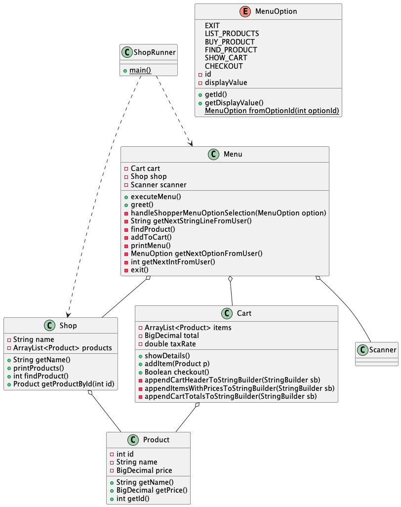

## T-Shirt Storefront 

## Description
    This is a T-Shirt Storefront with a command line interface that allows users 
    to list available t-shirts, view and search t-shirts, add t-shirts to their
    cart, see their cart, and check out.
## UML Diagram

## The ShopRunner class is the main entry point for the application.
    It encapsulates a Menu, providing it with a Scanner configured
    with System.in to allow the menu to read from standard in.
    When the application starts, the menu's greet and show methods are called.
    
## Cart class is responsible for managing the contents of the cart.
    An instance of this class may hold 0 to n items. It also maintains
    an internal state of the total price of all the items in the cart.

    When the cart contains items, a user may be checked out. Checking out
    prints the total with tax applied, thanks the user, and resets the
    total to 0.

    The cart maintains an internal tax rate of 10%, which is used
    in calculating the total with tax applied of all the items in the cart.

    A user may request to see the contents of the cart. When the cart
    contains items, the user will see the printed contents of the cart
    with a line by line breakdown of the items in it with prices, as well as
    the before and after tax totals of all of its items.
    
    Items may be added to the cart. Users adding items to the cart
    will see a printed confirmation.
    
    Currently, the cart may **NOT** be emptied directly.
    It also does **NOT** have a way of directly maintaining a quantity for each of
    its items.
## Menu class is responsible for greeting the user & showing a menu to the user for interaction with the application.
    The class maintains a String[] array of menu options, which it
    uses for printing the menu to standard out.
    The class maintains a Shop instance, which it uses for
    interactions with the shop.
    The class is also responsible for responding to user interaction
    with respect to its menu.

## Shop class maintains the shop's information.
    It encapsulates its name.
    It also encapsulates a list of products.
    It's responsible for printing products to standard out, when requested.
    It also is able to find a product by its name, when requested.

## Product class maintains the concept of a product in the application.
    It encapsulates a the product's name, and its price.